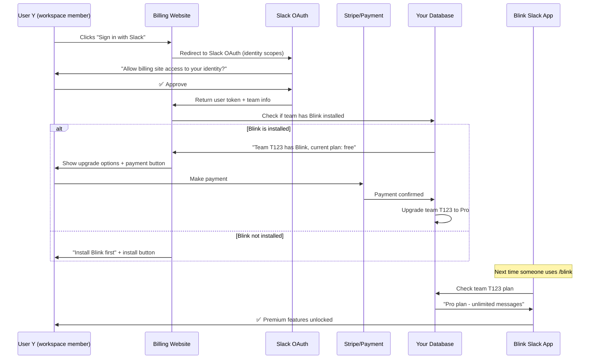

```mermaid
sequenceDiagram
    participant User as User Y (workspace member)
    participant BillingSite as Billing Website
    participant SlackOAuth as Slack OAuth
    participant PaymentGateway as Stripe/Payment
    participant Database as Your Database
    participant SlackApp as Blink Slack App

    User->>BillingSite: Clicks "Sign in with Slack"
    BillingSite->>SlackOAuth: Redirect to Slack OAuth (identity scopes)
    SlackOAuth->>User: "Allow billing site access to your identity?"
    User->>SlackOAuth: ✅ Approve
    SlackOAuth->>BillingSite: Return user token + team info
    BillingSite->>Database: Check if team has Blink installed

    alt Blink is installed
        Database->>BillingSite: "Team T123 has Blink, current plan: free"
        BillingSite->>User: Show upgrade options + payment button
        User->>PaymentGateway: Make payment
        PaymentGateway->>Database: Payment confirmed
        Database->>Database: Upgrade team T123 to Pro
    else Blink not installed
        BillingSite->>User: "Install Blink first" + install button
    end

    Note over SlackApp: Next time someone uses /blink
    SlackApp->>Database: Check team T123 plan
    Database->>SlackApp: "Pro plan - unlimited messages"
    SlackApp->>User: ✅ Premium features unlocked
```
